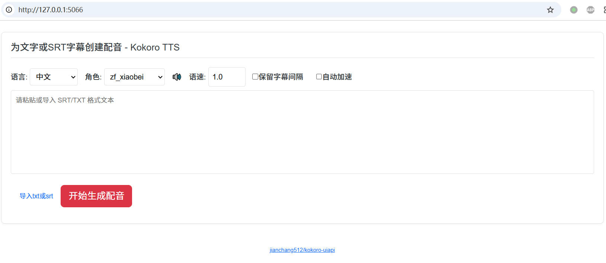

这是一个用于kokoro TTS项目的webui和api项目，支持中文、英文、日语、法语、意大利语、葡萄牙、西班牙、印地语共8种语言配音

## webui



启动后默认ui地址： http://127.0.0.1:5066

- 支持对文字和SRT字幕进行配音
- 支持在线试听和下载
- 支持对齐字幕


## API

api兼容 OpenAI TTS

启动后默认API地址：`http://127.0.0.1:5066/v1/audio/speech`

请求方法：`POST`
请求数据:
`application/json`

```
{
		input:需要配音的文字,
		voice:配音角色,
		speed:语速默认1.0
}
```
	
成功返回mp3音频数据

**OpenAI SDK 使用示例**

```
from openai import OpenAI
client = OpenAI(
    api_key='123456',
    base_url='http://127.0.0.1:5066/v1'
)

try:
    response = client.audio.speech.create(
		model='tts-1',
        input='你好啊，亲爱的朋友们',
        voice='zf_xiaobei',
        response_format='mp3',
        speed=1.0
	)
    with open('./test_openai.mp3', 'wb') as f:
        f.write(response.content)
    print("MP3 file saved successfully to test_openai.mp3")
except Exception as e:
    print(f"An error occurred: {e}")
	
```

## 角色列表

英语配音角色：

```

af_alloy
af_aoede
af_bella
af_jessica
af_kore
af_nicole
af_nova
af_river
af_sarah
af_sky
am_adam
am_echo
am_eric
am_fenrir
am_liam
am_michael
am_onyx
am_puck
am_santa
bf_alice
bf_emma
bf_isabella
bf_lily
bm_daniel
bm_fable
bm_george
bm_lewis

```

中文角色：

```
zf_xiaobei
zf_xiaoni
zf_xiaoxiao
zf_xiaoyi
zm_yunjian
zm_yunxi
zm_yunxia
zm_yunyang
```

日语角色: 
```
jf_alpha
jf_gongitsune
jf_nezumi
jf_tebukuro
jm_kumo
```

法语角色: `ff_siwis `

意大利语角色: `if_sara,im_nicola`

印地语角色:`hf_alpha,hf_beta,hm_omega,hm_psi`

西班牙语角色:`ef_dora,em_alex,em_santa`

葡萄牙语角色:`pf_dora,pm_alex,pm_santa`


## 安装方法

### Windows 

win10/11 可直接下载整合包，双击 `start.bat` 即可启动,若需GPU加速，请确保拥有NVIDIA显卡并安装CUDA12

### Linux/MacOS

首先确保系统已安装python3.8+,建议 3.10-3.11

> Linux上使用 `apt install ffmpeg` 或 `yum install ffmpeg` 预先安装 ffmpeg
>
> MacOS使用 `brew install ffmpeg` 安装ffmpeg

1. 拉取源码 `git clone https://github.com/jianchang512/kokoro-uiapi`
2. 创建虚拟环境并激活 
	```
	cd kokoro-uiapi
	python3 -m venv venv
	. venv/bin/activate
	
	```
3. 安装依赖 `pip3 install -r requirements.txt`
4. 启动 `python3 app.py`


## 代理VPN

源码部署方式需从 huggingface.co 上下载音色pt文件，需提前设置全局代理或系统代理，确保可访问

也可以提前下载好模型解压到 app.py 所在目录下。 

模型下载地址 https://github.com/jianchang512/kokoro-uiapi/releases/download/0.1/moxing--jieya--dao--app.py--mulu.7z

## Credit

- [Kokoro-82M](https://github.com/hexgrad/kokoro)